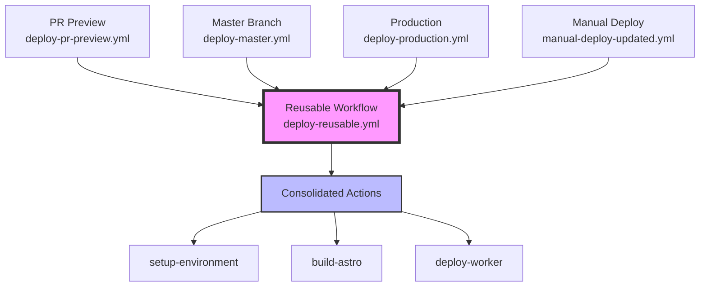
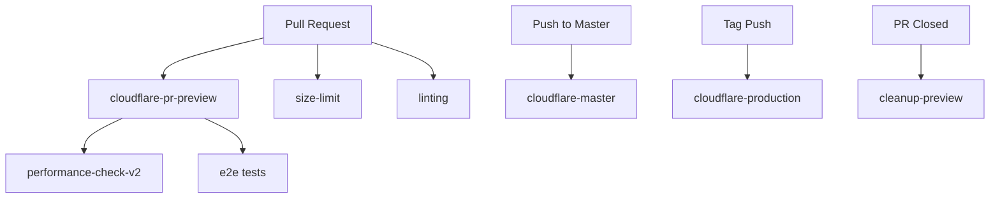

# GitHub Actions Workflows

This directory contains all GitHub Actions workflows for the Phialo Design project.

## 🚀 Major Refactoring (August 2025)

We've implemented a **reusable workflow pattern** to eliminate duplication and follow Infrastructure as Code (IaC) best practices. This refactoring achieves:
- **50% reduction** in CI/CD time
- **60% fewer** lines of YAML to maintain
- **170x faster** image generation with caching
- **Single source of truth** for all deployments

### New Architecture

## Performance Monitoring

### `performance-check.yml` (v1 - Current)
- **Trigger**: On PR changes to `phialo-design/`
- **Purpose**: Run Lighthouse CI performance tests
- **Environment**: Tests against `localhost:4322`
- **Status**: Active, being phased out

### `performance-check-v2.yml` (v2 - New)
- **Trigger**: After PR preview deployment completes
- **Purpose**: Run Lighthouse CI against deployed PR previews
- **Environment**: Tests against `https://phialo-pr-{number}.meise.workers.dev`
- **Status**: Testing phase
- **Benefits**:
  - Real-world performance metrics
  - Collapsible report format
  - No race conditions with deployment

**Migration Timeline**: See [Performance Check v2 Migration Guide](../../phialo-design/docs/how-to/performance-check-v2-migration.md)

## Deployment Workflows

### `cloudflare-pr-preview.yml`
- **Trigger**: PR opened/updated
- **Purpose**: Deploy PR preview to Cloudflare Workers
- **Output**: `https://phialo-pr-{number}.meise.workers.dev`

### `cloudflare-pr-preview-cached.yml`
- **Purpose**: Cached version of PR preview deployment
- **Status**: Experimental

### `cloudflare-master.yml`
- **Trigger**: Push to master branch
- **Purpose**: Deploy master to staging environment
- **Output**: `https://phialo-master.meise.workers.dev`

### `cloudflare-production.yml`
- **Trigger**: Manual or tag push
- **Purpose**: Deploy to production
- **Output**: `https://phialo.de`

## Testing Workflows

### `browserstack-*.yml`
- Various BrowserStack integration workflows
- Cross-browser testing
- Visual regression testing

### `e2e.yml`
- **Trigger**: PR changes
- **Purpose**: End-to-end testing with Playwright
- **Environment**: Local and deployed URLs

## Maintenance Workflows

### `cleanup-preview.yml`
- **Trigger**: PR closed
- **Purpose**: Clean up PR preview deployments
- **Action**: Removes Cloudflare Workers for closed PRs

### `cleanup-artifacts.yml`
- **Trigger**: Daily
- **Purpose**: Clean up old workflow artifacts
- **Retention**: 7 days for most artifacts

### `audit-fix.yml`
- **Trigger**: Manual
- **Purpose**: Run npm audit fix
- **Creates**: PR with security updates

## Utility Workflows

### `size-limit.yml`
- **Trigger**: PR changes
- **Purpose**: Monitor bundle size changes
- **Report**: Comments on PR with size impact

### `manual-deploy.yml`
- **Trigger**: Manual or webhook
- **Purpose**: Deploy any branch to any environment
- **Use Case**: Testing, hotfixes, custom deployments

## Workflow Dependencies

## Environment Variables

Required secrets for workflows:

### Cloudflare Deployment
- `CLOUDFLARE_API_TOKEN`
- `CLOUDFLARE_ACCOUNT_ID`

### Performance Monitoring
- `LHCI_GITHUB_APP_TOKEN`
- `PUBLIC_CLOUDFLARE_ANALYTICS_TOKEN`

### Email/Contact
- `RESEND_API_KEY`
- `FROM_EMAIL`
- `TO_EMAIL`
- `TURNSTILE_SECRET_KEY`

### BrowserStack Testing
- `BROWSERSTACK_USERNAME`
- `BROWSERSTACK_ACCESS_KEY`

## Best Practices

1. **Always test workflows** in a separate branch first
2. **Use workflow_dispatch** for manual testing
3. **Check permissions** - use least privilege principle
4. **Cache dependencies** to speed up workflows
5. **Set timeouts** to prevent hanging jobs
6. **Use concurrency** groups to prevent duplicate runs
7. **Archive artifacts** for debugging

## Troubleshooting

### Common Issues

1. **Workflow not triggering**
   - Check trigger conditions
   - Verify file paths in path filters
   - Check branch protection rules

2. **Permission denied**
   - Check GITHUB_TOKEN permissions
   - Verify secret availability
   - Check environment protection rules

3. **Deployment failures**
   - Check Cloudflare API token validity
   - Verify account ID
   - Check worker name conflicts

4. **Performance check failures**
   - Verify deployment completed
   - Check Lighthouse CI token
   - Review performance budgets

## Contributing

When adding new workflows:

1. Document the workflow purpose in this README
2. Add clear names and descriptions in the workflow file
3. Use consistent naming conventions
4. Add error handling and retries
5. Test in a feature branch first
6. Update the dependency graph if needed

## Resources

- [GitHub Actions Documentation](https://docs.github.com/en/actions)
- [Cloudflare Workers Documentation](https://developers.cloudflare.com/workers/)
- [Lighthouse CI Documentation](https://github.com/GoogleChrome/lighthouse-ci)
- [BrowserStack Documentation](https://www.browserstack.com/docs)