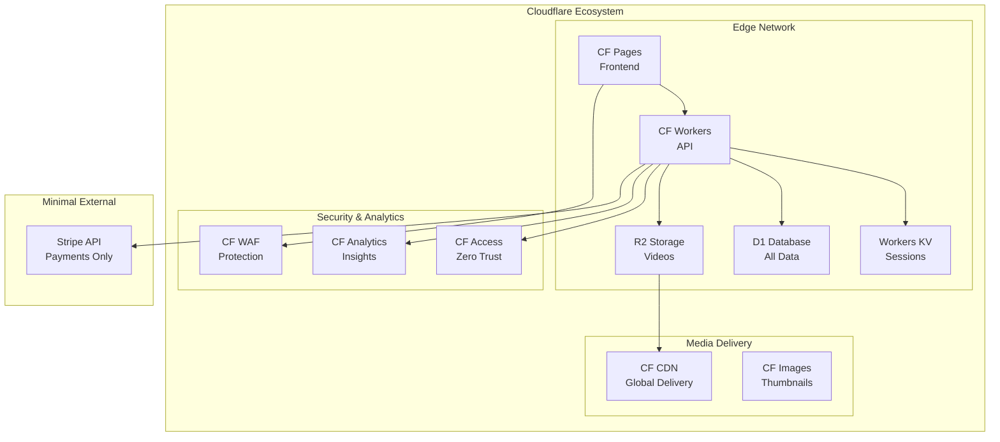
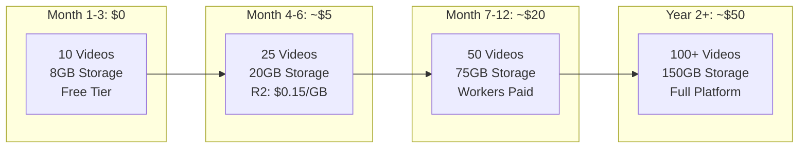

# Video Portal Architecture Update: All-Cloudflare Implementation

## 🔄 Architecture Changes for Maximum Cloudflare Usage

Based on the cost analysis and free tier evaluation, here's the updated architecture using Cloudflare services wherever possible:

### Original vs Updated Service Stack

| Component | Original Proposal | Updated (All-Cloudflare) | Free Tier? |
|-----------|------------------|-------------------------|------------|
| **Frontend** | Astro + React | Cloudflare Pages (Astro) | ✅ Yes |
| **API Layer** | CF Workers | CF Workers | ✅ 100k/day |
| **Database** | CF D1 | CF D1 | ✅ 5GB |
| **Session Store** | CF KV | CF KV | ✅ 100k/day |
| **Video Storage** | CF Stream + R2 | CF R2 Only | ✅ 10GB |
| **CDN** | CF Stream | CF CDN (built-in) | ✅ Yes |
| **Authentication** | Auth0/Supabase | CF Access OR Custom | ⚠️ $3/user |
| **Email** | SendGrid | CF Email Workers | ⚠️ Via API |
| **Analytics** | Mixpanel | CF Analytics | ✅ Yes |
| **Booking** | Cal.com | CF Workers + D1 | ✅ Custom |

## 🏗️ Updated Architecture Diagram



## 💰 Free Tier Implementation Strategy

### Phase 1: Complete Free Tier (0-10 Videos)

```typescript
// config/free-tier.ts
export const FREE_TIER_CONFIG = {
  storage: {
    provider: 'cloudflare-r2',
    limits: {
      total: '10GB',
      perVideo: '1GB',
      maxVideos: 10
    }
  },
  workers: {
    requests: 100_000, // per day
    cpu: 10, // ms per request
  },
  kv: {
    reads: 100_000, // per day
    writes: 1_000 // per day
  },
  d1: {
    storage: '5GB',
    reads: 5_000_000, // per day
    writes: 100_000 // per day
  }
};
```

### Custom Authentication Implementation (Free)

```typescript
// workers/auth.ts
export class AuthHandler {
  async handleLogin(request: Request, env: Env) {
    // Custom JWT implementation using Workers KV
    const user = await this.validateCredentials(request);
    const token = await this.generateJWT(user, env.JWT_SECRET);
    
    // Store session in KV (free tier: 100k reads/day)
    await env.SESSIONS.put(
      `session:${user.id}`,
      JSON.stringify({ token, user }),
      { expirationTtl: 86400 * 7 } // 7 days
    );
    
    return new Response(JSON.stringify({ token }));
  }
}
```

### Video Storage with R2 (Free Tier Optimized)

```typescript
// workers/video-upload.ts
export async function handleVideoUpload(request: Request, env: Env) {
  const formData = await request.formData();
  const video = formData.get('video') as File;
  
  // Check free tier limits
  const usage = await env.D1.prepare(
    'SELECT SUM(size_bytes) as total FROM videos'
  ).first();
  
  if (usage.total + video.size > 10 * 1024 * 1024 * 1024) { // 10GB
    return new Response('Free tier limit exceeded', { status: 402 });
  }
  
  // Upload to R2 (free egress!)
  const key = `videos/${crypto.randomUUID()}.mp4`;
  await env.R2.put(key, video.stream());
  
  // Generate thumbnail with CF Images API
  const thumbnail = await generateThumbnail(video);
  await env.R2.put(`thumbnails/${key}.jpg`, thumbnail);
  
  return new Response('Upload successful');
}
```

## 📊 Cost Progression Model



## 🚀 Implementation Roadmap

### Week 1-2: Core Infrastructure (Free)
- [ ] Set up Cloudflare Pages for frontend
- [ ] Configure Workers for API
- [ ] Initialize D1 database with schema
- [ ] Implement KV session storage

### Week 3-4: Authentication & User Management (Free)
- [ ] Custom JWT auth with Workers
- [ ] Social login via Workers (Google OAuth)
- [ ] User profiles in D1
- [ ] Session management in KV

### Week 5-6: Video Platform MVP (Free)
- [ ] R2 bucket configuration
- [ ] Video upload handler (< 10GB total)
- [ ] HLS.js player integration
- [ ] Basic video catalog

### Week 7-8: Commerce Integration ($5/mo Stripe fees)
- [ ] Stripe integration for payments
- [ ] Purchase tracking in D1
- [ ] Access control via Workers

## 🔑 Key Free Tier Optimizations

1. **Video Compression Pipeline**:
   ```bash
   # Pre-upload compression (client-side)
   ffmpeg -i input.mp4 -c:v libx264 -crf 28 -preset slow output.mp4
   ```

2. **Intelligent Caching**:
   ```typescript
   // Cache video metadata aggressively
   const cache = caches.default;
   const cacheKey = new Request(`https://cache.phialo.de/video/${id}`);
   ```

3. **Request Batching**:
   ```typescript
   // Batch D1 queries to stay under limits
   const batchQuery = env.D1.batch([
     env.D1.prepare('SELECT * FROM videos WHERE ...'),
     env.D1.prepare('SELECT * FROM users WHERE ...')
   ]);
   ```

## 🎯 When to Upgrade from Free Tier

| Metric | Free Tier Limit | Upgrade Trigger | Next Tier Cost |
|--------|----------------|-----------------|----------------|
| Storage | 10GB | 8GB used | ~$0.15/month |
| API Requests | 100k/day | 80k/day avg | $5/month |
| Database | 5GB | 4GB used | $5/month |
| Video Views | ~10k/month | Approaching limit | $5/month |

## ✅ Benefits of All-Cloudflare Approach

1. **Zero Egress Fees**: Save $1000s annually
2. **Single Dashboard**: Manage everything in one place
3. **Native Integration**: Services work seamlessly together
4. **Global Performance**: 300+ edge locations
5. **Built-in Security**: DDoS, WAF, bot protection included
6. **Generous Free Tier**: Can run MVP for months at $0

## 🚨 Limitations to Consider

1. **No Video Transcoding**: Must upload multiple qualities
2. **No Built-in DRM**: Use HLS encryption instead
3. **Custom Auth Required**: No managed auth in free tier
4. **Manual Video Processing**: No automatic thumbnails

## 💡 Recommendation

Start with the **all-Cloudflare free tier** approach. This allows:
- Zero initial investment
- Prove concept before scaling
- Learn platform capabilities
- Gradual cost increase aligned with growth

Only consider alternatives (Backblaze B2, Bunny.net) if you need:
- Massive storage (>1TB)
- Advanced video processing
- Specific features not available in Cloudflare

The all-Cloudflare approach provides the best balance of cost, performance, and simplicity for the Phialo Design video portal! 🚀