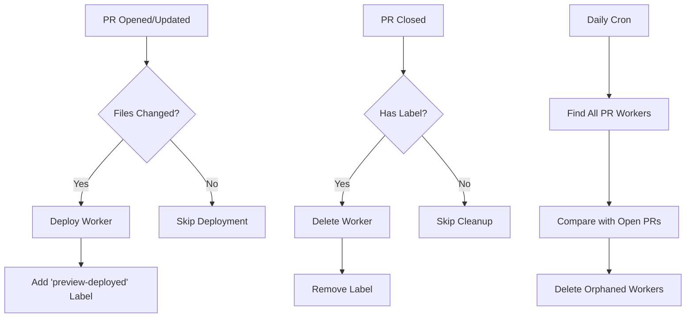

# How to Clean Up Cloudflare Workers

This guide explains how to manage and clean up Cloudflare Workers, particularly ephemeral PR preview deployments.

## Automatic Cleanup

The project now implements a robust automatic cleanup system:

### 1. Label-Based Cleanup (Primary Method)
- When a PR is deployed, it receives a `preview-deployed` label
- When the PR is closed, the cleanup workflow only runs if this label exists
- This prevents unnecessary cleanup attempts for PRs that never had deployments
- The label is automatically removed after successful cleanup

### 2. Orphaned Workers Cleanup (Safety Net)
- Runs daily at 2 AM UTC
- Compares existing workers with open PRs
- Removes workers for closed/merged PRs
- Can be manually triggered via GitHub Actions UI

## Manual Cleanup

### Using the Cleanup Script

1. **Set Environment Variables**
   ```bash
   export CLOUDFLARE_API_TOKEN='your-api-token'
   export CLOUDFLARE_ACCOUNT_ID='your-account-id'
   ```

2. **Run the Cleanup Script**
   ```bash
   ./scripts/cleanup-pr-workers.sh
   ```

   The script will:
   - List all PR workers in your account
   - Ask for confirmation before deletion
   - Delete each worker and report results

### Using Wrangler CLI

1. **Install Wrangler**
   ```bash
   cd workers
   npm install wrangler@4.27.0
   ```

2. **List Workers via API**
   ```bash
   curl -X GET "https://api.cloudflare.com/client/v4/accounts/$CLOUDFLARE_ACCOUNT_ID/workers/scripts" \
        -H "Authorization: Bearer $CLOUDFLARE_API_TOKEN" \
        -H "Content-Type: application/json" | jq -r '.result[].id'
   ```

3. **Delete Specific Worker**
   ```bash
   npx wrangler delete --name "phialo-pr-123" --force
   ```

### Using GitHub Actions

Trigger the orphaned workers cleanup manually:

1. Go to Actions tab in GitHub
2. Select "Cloudflare Orphaned Workers Cleanup"
3. Click "Run workflow"
4. Choose "Dry run" to preview what would be deleted
5. Run without dry run to actually delete workers

## Troubleshooting

### Workers Not Being Deleted

**Problem**: Cleanup workflow runs but workers remain

**Solutions**:
1. Check if the PR has the `preview-deployed` label
2. Verify API token has sufficient permissions
3. Check workflow logs for specific error messages
4. Manually run the orphaned workers cleanup

### Permission Errors

**Problem**: "Unauthorized" or "Forbidden" errors

**Required Permissions**:
- Account: `Workers Scripts:Edit`
- Account: `Workers KV Storage:Edit` (if using KV)

### Finding Orphaned Workers

Run this command to find workers without corresponding open PRs:

```bash
# Get all PR workers
WORKERS=$(curl -s -X GET "https://api.cloudflare.com/client/v4/accounts/$CLOUDFLARE_ACCOUNT_ID/workers/scripts" \
     -H "Authorization: Bearer $CLOUDFLARE_API_TOKEN" \
     -H "Content-Type: application/json" | jq -r '.result[].id' | grep '^phialo-pr-')

# Get open PR numbers
OPEN_PRS=$(gh pr list --state open --json number -q '.[].number')

# Find orphaned workers
for worker in $WORKERS; do
  PR_NUM=${worker#phialo-pr-}
  if ! echo "$OPEN_PRS" | grep -q "^$PR_NUM$"; then
    echo "Orphaned: $worker"
  fi
done
```

## Prevention Best Practices

1. **Always use labeled deployments**: The new workflow ensures only deployed PRs trigger cleanup
2. **Monitor the daily cleanup job**: Check for issues reported automatically
3. **Review PR labels**: Ensure `preview-deployed` label is properly managed
4. **Test cleanup locally**: Use dry run mode before actual deletion

## Workflow Architecture



## Related Documentation

- [PR Preview Deployments](./pr-preview-deployments.md)
- [Cloudflare Workers Setup](./cloudflare-setup.md)
- [GitHub Actions Workflows](../architecture/github-actions.md)