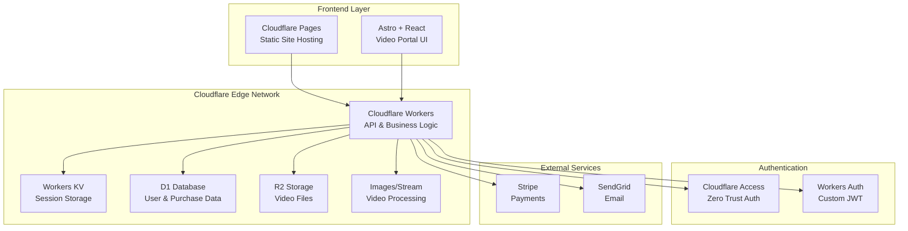
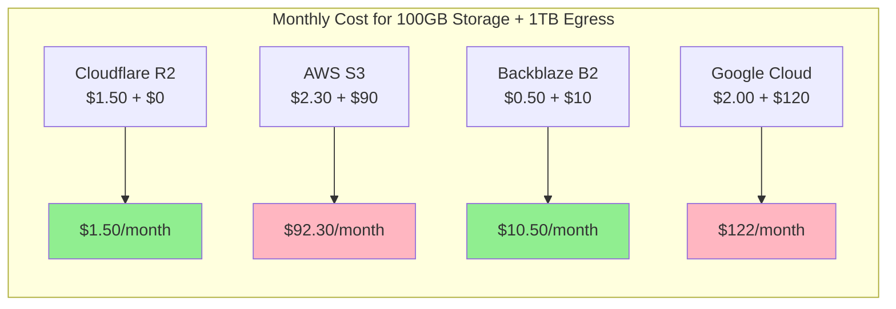

# Cloudflare Video Portal Architecture Analysis & Cost Comparison

## Executive Summary

This analysis evaluates migrating the proposed video portal architecture to maximize Cloudflare services usage while maintaining free tier compatibility and comparing costs with alternative providers.

## 🏗️ Proposed All-Cloudflare Architecture



## 💰 Free Tier Analysis

### ✅ Cloudflare Free Tier Limits

| Service | Free Tier | Sufficient for MVP? |
|---------|-----------|-------------------|
| **Workers** | 100,000 requests/day | ✅ Yes (3,000,000/month) |
| **Workers KV** | 100,000 reads/day | ✅ Yes |
| **D1 Database** | 5GB storage | ✅ Yes |
| **R2 Storage** | 10GB/month | ⚠️ Limited for videos |
| **Pages** | Unlimited sites | ✅ Yes |
| **Stream** | ❌ No free tier | ❌ $5/1000 min stored |

### 🎥 Video Storage Requirements

For a typical jewelry tutorial portal:
- Average video: 30 minutes @ 1080p = ~1.5GB
- 10 videos = 15GB (exceeds R2 free tier)
- 100 videos = 150GB storage needed

## 📊 Cost Comparison: Video Storage & Delivery



### 📈 Detailed Cost Breakdown (100 Videos, 150GB, 2TB Monthly Bandwidth)

| Provider | Storage Cost | Egress Cost | API Calls | Total Monthly | Annual Cost |
|----------|--------------|-------------|-----------|---------------|-------------|
| **Cloudflare R2** | $2.25 | $0 | $0 | **$2.25** | **$27** |
| **Cloudflare Stream** | $150 | $30 | $0 | **$180** | **$2,160** |
| **Backblaze B2** | $0.75 | $20 | $0 | **$20.75** | **$249** |
| **Bunny.net CDN** | $1.50 | $10 | $0 | **$11.50** | **$138** |
| **AWS S3 + CloudFront** | $12.75 | $180 | $5 | **$197.75** | **$2,373** |
| **Google Cloud** | $3.00 | $240 | $5 | **$248** | **$2,976** |

## 🚀 Recommended Architecture (Free Tier Optimized)

### Option 1: Pure Cloudflare (Partial Free Tier)

```yaml
Frontend: Cloudflare Pages (Free)
API: Cloudflare Workers (Free tier: 100k req/day)
Database: D1 (Free tier: 5GB)
Sessions: Workers KV (Free tier: 100k reads/day)
Video Storage: R2 ($0.015/GB/month after 10GB free)
Video Processing: Manual upload, no transcoding
Auth: Cloudflare Access ($3/user/month) OR Custom JWT (free)
```

**Monthly Cost Estimate (10 videos, 15GB):**
- R2 Storage: $0.08 (5GB over free tier)
- Workers/KV/D1: $0 (within free tier)
- Total: **$0.08/month** 🎉

### Option 2: Hybrid Approach (Maximum Cost Efficiency)

```yaml
Frontend: Cloudflare Pages (Free)
API: Cloudflare Workers (Free tier)
Database: D1 (Free tier)
Video Storage: Backblaze B2 + Bunny.net CDN
Video Processing: Bunny Stream ($9/month + usage)
Auth: Custom JWT with Workers (free)
```

**Monthly Cost Estimate (100 videos, 150GB, 2TB bandwidth):**
- Backblaze B2: $0.75
- Bunny.net CDN: $10
- Bunny Stream: $9 base
- Total: **~$20/month**

## 🔧 Implementation Recommendations

### Phase 1: MVP with Free Tier (0-10 videos)
```javascript
// Use Cloudflare R2 for storage (free tier)
const videoStorage = {
  provider: 'cloudflare-r2',
  bucket: 'phialo-videos',
  maxSize: '10GB', // Stay within free tier
  delivery: 'direct' // No CDN needed at this scale
};
```

### Phase 2: Growth (10-50 videos)
```javascript
// Migrate to hybrid approach
const videoStorage = {
  provider: 'backblaze-b2',
  bucket: 'phialo-videos',
  cdn: 'bunny.net',
  delivery: 'streaming',
  drm: false // Add later if needed
};
```

### Phase 3: Scale (50+ videos)
```javascript
// Full video platform
const videoStorage = {
  provider: 'cloudflare-stream', // OR bunny-stream
  features: ['transcoding', 'drm', 'analytics'],
  delivery: 'adaptive-bitrate',
  storage: 'unlimited'
};
```

## 🎯 Free Tier Maximization Strategy

1. **Start with R2**: Use Cloudflare R2's 10GB free tier for initial videos
2. **Optimize Videos**: Compress to 720p for tutorials (reduces size by 60%)
3. **Progressive Enhancement**: Add videos gradually as revenue grows
4. **Lazy Migration**: Move to paid tiers only when necessary

## 📌 Key Advantages of All-Cloudflare Approach

### ✅ Pros:
- **Single vendor simplicity**: One dashboard, one bill
- **Zero egress fees**: R2 has free bandwidth
- **Global performance**: Cloudflare's edge network
- **Integrated security**: DDoS, WAF included
- **Developer experience**: Excellent documentation

### ⚠️ Cons:
- **No Stream free tier**: Minimum $5/month
- **Limited video features**: R2 doesn't transcode
- **Vendor lock-in**: Harder to migrate later

## 💡 Final Recommendation

**For Phialo Design Video Portal:**

1. **Start with Cloudflare R2** (Free → $0.08/month for 15GB)
   - Upload videos manually
   - Use HLS.js for streaming
   - No transcoding (upload multiple qualities)

2. **Authentication**: Custom JWT with Workers (free)
   - Social login via Workers
   - Sessions in KV (free tier)

3. **Database**: D1 for all data (free 5GB)

4. **When to upgrade**:
   - At 10+ videos: Consider Bunny.net CDN
   - At 50+ videos: Evaluate Cloudflare Stream
   - At 100+ videos: Full video platform needed

**Estimated Timeline to Paid Tiers:**
- Month 1-3: $0 (free tier)
- Month 4-6: ~$5/month (R2 storage)
- Month 7-12: ~$20/month (CDN added)
- Year 2+: ~$180/month (full platform)

This approach allows starting completely free and scaling costs with business growth! 🚀