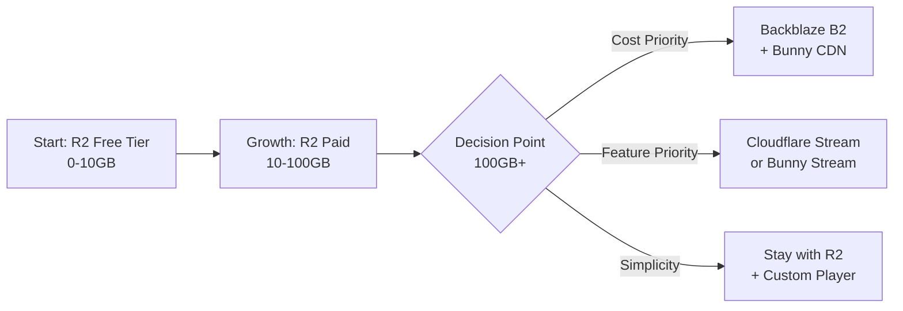

# Video Storage Provider Cost Comparison 2024

## 📊 Visual Cost Comparison

### Storage Cost per TB/Month
```
Backblaze B2    |██| $5
Cloudflare R2   |███| $15  
Bunny.net       |███| $15
AWS S3          |█████████████████| $85
Google Cloud    |████████████████| $80
Azure           |█████████████████| $85
```

### Egress Cost per TB
```
Cloudflare R2   |◻️| $0 (FREE!)
Backblaze B2*   |◻️| $0 (FREE with CDN partners)
Bunny.net       |██| $10
Backblaze B2    |██| $10 (without partners)
AWS CloudFront  |██████████████████| $85-90
Google Cloud    |████████████████████████| $120
Azure CDN       |██████████████████| $87
```
*When paired with Cloudflare, Bunny.net, or other partners

## 💰 Real-World Scenario: 100 Tutorial Videos

### Assumptions:
- 100 videos × 1.5GB each = 150GB total storage
- 2TB monthly bandwidth (each video watched ~13 times)
- 1 million API requests/month

### Annual Cost Comparison

```
┌─────────────────────────────────────────────────────────┐
│ Provider           │ Storage │ Egress │ APIs │  TOTAL   │
├─────────────────────────────────────────────────────────┤
│ Cloudflare R2      │   $27   │   $0   │  $0  │   $27    │
│ Backblaze + Bunny  │   $9    │  $120  │  $0  │   $129   │
│ Bunny.net Storage  │   $27   │  $120  │  $0  │   $147   │
│ Cloudflare Stream  │  $900   │ $1,260 │  $0  │  $2,160  │
│ AWS S3+CloudFront  │  $153   │ $2,160 │  $60 │  $2,373  │
│ Google Cloud       │   $36   │ $2,880 │  $60 │  $2,976  │
│ Azure              │  $153   │ $2,088 │  $60 │  $2,301  │
└─────────────────────────────────────────────────────────┘
```

## 🎯 Best Options by Use Case

### 🏆 Best Overall Value: **Cloudflare R2**
- ✅ Zero egress fees
- ✅ S3-compatible API  
- ✅ Global CDN included
- ✅ 10GB free tier
- ⚠️ No video processing

### 🚀 Best for Scale: **Backblaze B2 + Bunny.net**
- ✅ Lowest storage cost ($5/TB)
- ✅ Free egress to CDN partners
- ✅ Bunny Stream available ($9/mo base)
- ✅ Global CDN performance
- ⚠️ Two vendors to manage

### 🎥 Best Video Features: **Cloudflare Stream**
- ✅ Automatic transcoding
- ✅ Adaptive bitrate streaming
- ✅ Built-in player
- ✅ Analytics included
- ❌ No free tier
- ❌ Expensive for storage

### 📱 Best Free Tier: **Cloudflare Stack**
- ✅ R2: 10GB storage free
- ✅ Workers: 100k requests/day free
- ✅ KV: 100k reads/day free  
- ✅ D1: 5GB database free
- ✅ Pages: Unlimited sites free

## 🔄 Migration Path Recommendation



## 📈 Cost Projection Over Time

```
Monthly Cost Growth Trajectory
$300 ┤                                    ╱─ AWS S3
$250 ┤                                ╱───── Google
$200 ┤                            ╱─────────── Stream
$150 ┤                        ╱───────────────
$100 ┤                    ╱───────────────────
 $50 ┤            ╱───────────────────── Bunny
 $25 ┤    ╱───────────────────────────── R2
  $0 └────┴────┴────┴────┴────┴────┴────┴────
      0   10   25   50   75  100  150  200 Videos
```

## 🎬 Recommended Architecture for Phialo

### Phase 1 (0-10 videos): **Free Tier Champion**
```yaml
Storage: Cloudflare R2 (free 10GB)
Delivery: Direct from R2 (free egress)
Player: Video.js (open source)
Cost: $0/month
```

### Phase 2 (10-50 videos): **Smart Scaling**
```yaml
Storage: Cloudflare R2 ($0.75/month)
Delivery: R2 with CF CDN (free egress)
Player: Video.js with HLS
Cost: ~$1/month
```

### Phase 3 (50+ videos): **Performance Mode**
```yaml
Storage: Backblaze B2 ($0.50/month per 100GB)
CDN: Bunny.net ($10/month per TB)
Streaming: Bunny Stream ($9 base + usage)
Cost: ~$25-50/month
```

## 💡 Pro Tips

1. **Compress First**: Use HandBrake to reduce file sizes by 50-70%
2. **Progressive Upload**: Upload lower qualities first, add 4K later
3. **Lazy Load**: Only load video posters, not full videos
4. **Cache Aggressively**: Use Cloudflare's caching rules
5. **Monitor Usage**: Set up alerts before hitting paid tiers

## 🚨 Hidden Costs to Avoid

| Provider | Hidden Cost | Impact |
|----------|------------|--------|
| AWS | NAT Gateway, Load Balancer | +$45/month minimum |
| Google | Operations charges | +$50-100/month |
| Azure | Data processing | +$30-50/month |
| Cloudflare | None | $0 |
| Backblaze | None | $0 |

Choose **Cloudflare R2** for simplicity and zero egress fees, or **Backblaze B2 + Bunny.net** for the absolute lowest cost at scale!