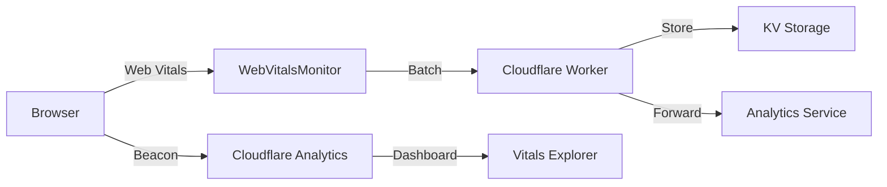

# Performance Monitoring Architecture

## Overview

Phialo Design implements a comprehensive, multi-layered performance monitoring strategy that combines Real User Monitoring (RUM) with synthetic testing to ensure optimal Core Web Vitals.

## Architecture Layers

### 1. Real User Monitoring (RUM)

#### Cloudflare Web Analytics (Primary)
- **Metrics**: LCP, INP, CLS, FCP, TTFB
- **Coverage**: 100% of real users
- **Privacy**: GDPR-compliant, no cookies
- **Dashboard**: [Cloudflare Dashboard](https://dash.cloudflare.com)
- **Features**:
  - Vitals Explorer for element-level debugging
  - Geographic and device segmentation
  - Near real-time updates

#### Custom Web Vitals Monitor (Enhanced)
- **Location**: `src/shared/components/performance/WebVitalsMonitor.astro`
- **Purpose**: Contextual data collection for deeper insights
- **Metrics**: All Core Web Vitals with attribution data
- **Features**:
  - Page type detection
  - Session correlation
  - Network condition tracking
  - Batch processing for efficiency
  - Astro-specific hydration timing

### 2. Synthetic Monitoring

#### Lighthouse CI
- **Configuration**: `.lighthouserc.js`
- **Frequency**: Every PR, nightly runs
- **Metrics**: All Core Web Vitals + performance score
- **Budgets**:
  - Performance Score: ≥ 90%
  - LCP: < 2500ms
  - CLS: < 0.1
  - INP (estimated from TBT): < 200ms
  - FCP: < 1800ms
  - TTFB: < 800ms

#### GitHub Actions Workflows
- **Performance Check** (`.github/workflows/performance-check.yml`): PR validation
- **Nightly Tests** (`.github/workflows/nightly-tests.yml`): Comprehensive testing

### 3. Data Collection Pipeline

## Core Web Vitals Targets

| Metric | Good | Needs Improvement | Poor | Our Target |
|--------|------|-------------------|------|------------|
| **LCP** | < 2.5s | 2.5s - 4s | > 4s | < 2.5s |
| **INP** | < 200ms | 200ms - 500ms | > 500ms | < 200ms |
| **CLS** | < 0.1 | 0.1 - 0.25 | > 0.25 | < 0.1 |
| **FCP** | < 1.8s | 1.8s - 3s | > 3s | < 1.8s |
| **TTFB** | < 800ms | 800ms - 1800ms | > 1800ms | < 800ms |

## Implementation Details

### WebVitalsMonitor Component

The component implements the following features:

1. **Attribution Data Collection**
   - LCP: Element, URL, render delays
   - CLS: Shift targets, values, timing
   - INP: Event type, input/processing/presentation delays
   - FCP: Time to first byte, load state
   - TTFB: DNS, connection, request durations

2. **Contextual Information**
   - Page type (home, portfolio, services, etc.)
   - Language (de/en)
   - Viewport dimensions
   - Network conditions (if available)
   - Device capabilities
   - Session ID for correlation

3. **Performance Optimizations**
   - Batch processing (5 metrics or 5 seconds)
   - `navigator.sendBeacon` for reliability
   - Web Worker execution via module scripts
   - Minimal bundle impact (~3KB gzipped)

### Cloudflare Worker Endpoint

The `/api/vitals` endpoint handles:

1. **Data Reception**
   - JSON and beacon API formats
   - CORS handling
   - Error resilience

2. **Processing**
   - Percentile bucketing
   - Issue detection
   - Performance problem tracking

3. **Storage Options**
   - KV namespace for 30-day retention
   - Forward to external analytics
   - Issue tracking for alerts

## Monitoring Strategy

### Phase 1: Baseline Establishment (Current)
- [x] Cloudflare Web Analytics integration
- [x] Lighthouse CI configuration
- [x] Performance budgets
- [x] Nightly testing

### Phase 2: Enhanced Monitoring (Implemented)
- [x] Web Vitals library with attribution
- [x] Contextual data collection
- [x] PR performance checks
- [x] Worker endpoint for metrics

### Phase 3: Optimization (Next Steps)
- [ ] Analyze collected RUM data
- [ ] Identify top performance issues
- [ ] Implement targeted optimizations
- [ ] A/B test improvements

## Performance Optimization Checklist

### LCP Optimizations
- [x] Preload hero images
- [x] Optimize server response time (Cloudflare Workers)
- [x] Remove render-blocking resources
- [x] Use CDN for static assets
- [ ] Implement resource hints for critical resources
- [ ] Optimize image formats (WebP/AVIF)

### INP Optimizations
- [x] Code splitting with dynamic imports
- [x] Defer non-critical JavaScript
- [ ] Break up long tasks
- [ ] Implement web workers for heavy computation
- [ ] Optimize event handlers

### CLS Optimizations
- [x] Set explicit dimensions on images
- [x] Reserve space for dynamic content
- [x] Use transform animations
- [ ] Optimize font loading (font-display: optional)
- [ ] Implement skeleton screens

### General Optimizations
- [x] Enable compression (gzip/brotli)
- [x] Implement caching headers
- [x] Optimize bundle size
- [x] Use Partytown for third-party scripts
- [ ] Implement service worker for offline support
- [ ] Optimize database queries

## Debugging Guide

### Using Cloudflare Vitals Explorer

1. Navigate to Cloudflare Dashboard → Web Analytics
2. Click on "Core Web Vitals" tab
3. Use filters:
   - Country
   - Device type
   - Browser
   - URL path
4. Click on specific elements in Vitals Explorer
5. Use CSS selectors in browser DevTools

### Using Custom Monitoring Data

1. Check browser console in development mode
2. Look for `[Web Vitals]` logs with color coding
3. Inspect attribution data for root causes
4. Check network tab for `/api/vitals` requests

### Common Issues and Solutions

| Issue | Likely Cause | Solution |
|-------|-------------|----------|
| High LCP | Large images, slow server | Optimize images, use CDN |
| High INP | Heavy JavaScript, long tasks | Code split, defer scripts |
| High CLS | Layout shifts, fonts | Set dimensions, optimize fonts |
| High TTFB | Slow server, no caching | Use edge caching, optimize backend |

## Alerting and Reporting

### Automated Alerts (Planned)
- Performance regression in PR
- Core Web Vitals threshold breach
- Significant metric degradation

### Reports
- PR performance comments
- Nightly performance reports
- Weekly trends analysis
- Monthly executive summary

## Tools and Resources

### Internal Tools
- WebVitalsMonitor: Custom RUM implementation
- Performance Check workflow: PR validation
- Lighthouse CI: Synthetic monitoring

### External Tools
- [Cloudflare Web Analytics](https://dash.cloudflare.com)
- [PageSpeed Insights](https://pagespeed.web.dev/)
- [Chrome DevTools Performance](https://developer.chrome.com/docs/devtools/performance/)
- [Web Vitals Chrome Extension](https://chrome.google.com/webstore/detail/web-vitals/ahfhijdlegdabablpippeagghigmibma)

### Documentation
- [Web Vitals](https://web.dev/vitals/)
- [INP Guide](https://web.dev/inp/)
- [Optimize LCP](https://web.dev/optimize-lcp/)
- [Optimize CLS](https://web.dev/optimize-cls/)

## Best Practices

1. **Monitor continuously**: Use RUM for real user impact
2. **Test synthetically**: Catch regressions before deployment
3. **Optimize incrementally**: Focus on biggest impact first
4. **Measure impact**: A/B test optimizations
5. **Document changes**: Track what worked and what didn't

## Future Enhancements

1. **Advanced Analytics**
   - User journey correlation
   - Business metric correlation
   - Conversion impact analysis

2. **Machine Learning**
   - Anomaly detection
   - Predictive performance issues
   - Automated optimization suggestions

3. **Enhanced Debugging**
   - Session replay integration
   - Performance timeline visualization
   - Root cause analysis automation